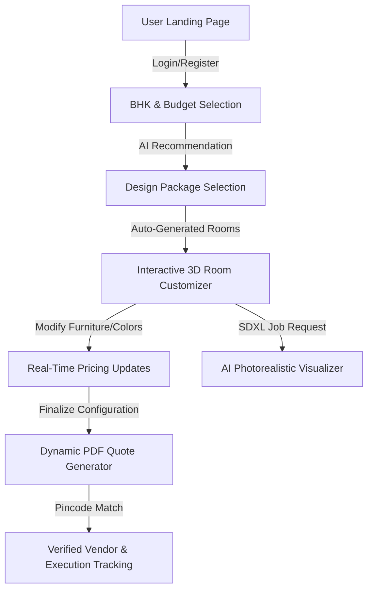

# 🏠 InteriorAI Platform

> **AI-Based Modular Interior Design & Visualization Platform**

InteriorAI is a comprehensive, premium web application designed to simplify the interior design journey for homeowners. By combining interactive 3D rendering, AI-powered photorealistic visualizations, real-time pricing updates, and verified contractor matching, the platform takes you from a blank BHK layout to a professional quotation and ready-to-execute design in under 10 minutes.

---

## 🚀 Key Features

*   **Interactive 3D Room Canvas**  
    Powered by **Three.js** and **React Three Fiber (R3F)**. Live 3D environment to customize walls, flooring, and adjust furniture arrangements (sofas, beds, wardrobes, kitchen counters, vanity units) in real time.
*   **AI Photorealistic Rendering**  
    Simulated **Stable Diffusion XL + ControlNet** rendering pipeline. Generate stunning, high-resolution photorealistic renders of your customized rooms under various interior styles (Modern, Scandinavian, Art-Deco, Luxury, Mediterranean, Tropical) in less than 15 seconds.
*   **Smart AI Recommendation Engine**  
    Scores and ranks catalog items and furniture packages using dynamic style compatibility matrices and budget-fitting algorithms to present the most cost-effective and aesthetic choices for your home.
*   **Real-Time Pricing & Dynamic Budgeting**  
    Every furniture addition, finish change, or room size modification instantly updates your total cost. Maintain granular control over your budget with zero price surprises.
*   **ReportLab PDF Quotation Generator**  
    Dynamically generates professional, bank-compliant PDF quotes with detailed room-by-room line items, GST breakdown, terms and conditions, and customized styling.
*   **Milestone & Contractor Tracker**  
    Assign projects to KYC-verified local contractors based on geo-matching (pincodes) and rating systems, then track project milestones (Demolition, Electrical, False Ceiling, Woodwork, Painting) with photo updates.

---

## 🛠️ Tech Stack

### Frontend (Next-Gen Web Interface)
*   **Framework:** Next.js 14 (App Router) & React 18
*   **Language:** TypeScript
*   **Styling:** TailwindCSS & Framer Motion (for smooth micro-animations)
*   **3D Graphics:** Three.js, `@react-three/fiber`, `@react-three/drei`
*   **State Management:** Zustand
*   **Data Fetching:** SWR (Stale-While-Revalidate) & Axios

### Backend (Robust RESTful API)
*   **Framework:** FastAPI (Python 3.10+)
*   **Server:** Uvicorn (ASGI)
*   **Database ORM:** SQLAlchemy (SQLite database by default: `interior_ai.db`)
*   **Data Validation:** Pydantic v2
*   **Authentication:** JWT (JSON Web Tokens) via `python-jose` & `passlib` (Bcrypt)
*   **PDF Generation:** ReportLab PDF library
*   **Image Processing:** Pillow

---

## 📁 Project Directory Structure

```text
Interior_Design/
├── 1_Click_Run.bat         # Windows automated launcher (Backend + Frontend + DB Seeding)
├── .gitignore              # Configured file exclusions (venv, node_modules, build outputs)
├── backend/
│   ├── .env                # Server configuration & JWT secrets
│   ├── requirements.txt    # Python package dependencies
│   ├── pdfs/               # Generated quotation PDFs & uploaded floor plans
│   └── app/
│       ├── __init__.py
│       ├── main.py         # Application entry point & router mounting
│       ├── db.py           # Database engine & session setup
│       ├── models.py       # SQLAlchemy database schemas (User, Project, Room, Product, etc.)
│       ├── schemas.py      # Pydantic schemas for request/response serialization
│       ├── auth_utils.py   # JWT token issuing and authentication dependencies
│       ├── seed_data.py    # Mock products, design packages, and vendors seeding
│       ├── routers/        # Modular API endpoints (Auth, Projects, Catalog, AI, PDF, etc.)
│       └── services/       # Core service modules (PDF creation, AI render mocks)
└── frontend/
    ├── package.json        # Frontend NPM script definitions & dependencies
    ├── next.config.js      # Next.js configurations
    ├── tsconfig.json       # TypeScript rules
    └── src/
        ├── app/            # Next.js App Router pages (Dashboard, Customizer, Visualizer, etc.)
        ├── components/     # Reusable UI widgets & Three.js Canvas (`RoomCanvas3D`)
        └── stores/         # State management stores (Auth, Project state synchronization)
```

---

## ⚡ Quick Start (Windows)

The repository comes with a batch script that automates environment check, dependency installation, database initialization, seeding, and server startup.

1. Double-click the **`1_Click_Run.bat`** file at the root folder of the project.
2. The script will:
   * Validate that **Python 3.10+** and **Node.js 18+** are installed.
   * Initialize a Python virtual environment (`.venv`) in `backend/` and install `requirements.txt`.
   * Install frontend dependencies via `npm install` in `frontend/`.
   * Initialize the SQLite database and seed it with high-quality default design packages, furniture catalogs, and vendor contacts.
   * Run the FastAPI server (`http://localhost:8000`) and the Next.js development server (`http://localhost:3000`).
   * Automatically open the platform in your browser at `http://localhost:3000`.

---

## 🔧 Manual Setup (All OS)

If you prefer to run the components manually, open two terminal windows:

### 1. Backend Setup
```bash
cd backend
# Create and activate python virtual environment
python -m venv .venv
source .venv/bin/activate       # On Windows: .venv\Scripts\activate

# Install dependencies
pip install -r requirements.txt

# Start FastAPI server
python -m uvicorn app.main:app --host 0.0.0.0 --port 8000 --reload
```
*   **API Documentation**: Access Swagger UI at `http://localhost:8000/docs`.

### 2. Frontend Setup
```bash
cd frontend
# Install node packages
npm install

# Start Next.js development server
npm run dev
```
*   **Client App**: Access the interface at `http://localhost:3000`.

---

## 🔄 Core Application Flow



---

## 🛡️ Security & Environment Settings

The backend configuration is managed via `backend/.env`. In production environments, make sure to change the default values:

```env
DATABASE_URL=sqlite:///./interior_ai.db
JWT_SECRET=your_secure_production_jwt_secret_key_here
JWT_ALGORITHM=HS256
ACCESS_TOKEN_EXPIRE_MINUTES=60
PDF_OUTPUT_DIR=./pdfs
```

---

## 📝 License
Built with ❤️ for Indian homeowners. Distributed under the MIT License. See `LICENSE` for more information.
